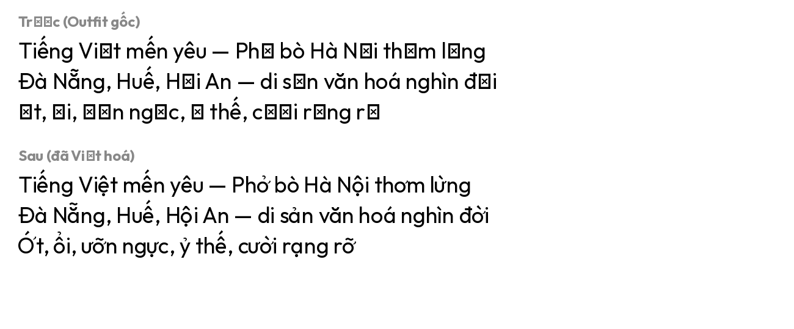
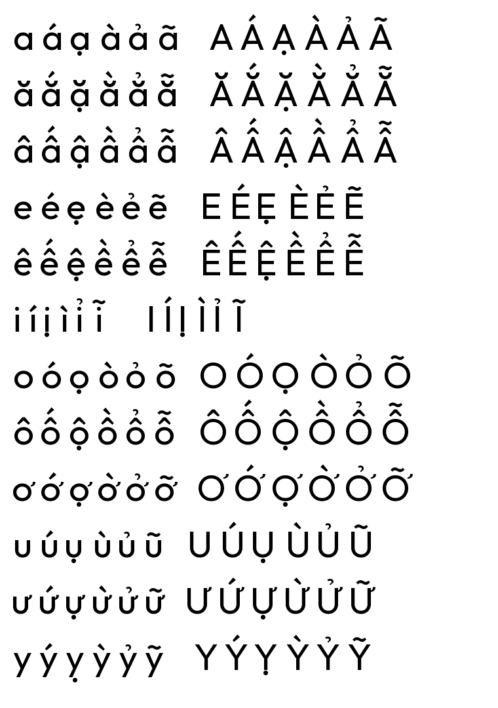

# viet-hoa-font

Công cụ Việt hoá font OTF/TTF — tự động bổ sung các ký tự tiếng Việt còn thiếu vào một font chữ Latin có sẵn, bằng cách kết hợp các glyph và dấu phụ mà font đã có (hoặc mượn từ một font donor) thành các ký tự tổ hợp như `ấ ằ ợ ử Ỡ Ự Đ`.



## Vấn đề

Rất nhiều font Latin đẹp trên Google Fonts, Adobe Fonts hay các bộ font thương mại chỉ hỗ trợ một phần tiếng Việt. Thường thì font có sẵn các chữ cái cơ bản và một vài dấu phụ (sắc, huyền, ngã), nhưng thiếu các tổ hợp đặc trưng tiếng Việt như:

- Các ký tự mang dấu hỏi (ả ẻ ỉ ỏ ủ ỷ) — thiếu dấu `◌̉`
- Các ký tự mang dấu nặng (ạ ẹ ị ọ ụ ỵ) — thiếu dấu `◌̣`
- Họ chữ có sừng (ơ ớ ờ ở ỡ ợ ư ứ ừ ử ữ ự) — thiếu dấu `◌̛`
- Đ / đ — chữ riêng không thể tổ hợp bằng dấu phụ
- Tổ hợp hai dấu chồng nhau như `ấ ầ ẩ ẫ ậ ắ ằ ẳ ẵ ặ ế ề ể ễ ệ ố ồ ổ ỗ ộ`

Công cụ này tự động phát hiện những ký tự thiếu, sinh ra các glyph tổ hợp tương ứng, đặt chúng vào đúng vị trí dùng dữ liệu anchor (GPOS) có sẵn của font, và lưu thành file font mới.

## Tính năng

- **134 ký tự tiếng Việt đầy đủ** (cả chữ hoa và chữ thường) trong dải Latin Extended Additional (U+1EA0–U+1EF9) cộng với Ơ, Ư, Đ, Ă, Â, Ê, Ô.
- **Hỗ trợ cả TTF và OTF** — tự động chọn cơ chế composite TrueType (glyf composite) hoặc CFF (flatten outlines).
- **Sử dụng anchor data** — nếu font đã có sẵn dữ liệu GPOS MarkBase, công cụ dùng đúng anchor mà nhà thiết kế đã cài, cho kết quả gần như đồng nhất với glyph được vẽ tay.
- **Heuristic thông minh** khi không có anchor: tự động ước lượng vị trí dấu dựa theo cap-height, x-height, và bbox của ký tự gốc.
- **Sắp dấu chồng đúng kiểu Việt Nam** — dấu thanh trên dấu mũ (như ấ, ề, ổ) được đặt theo phong cách typography Việt thật, không bị đẩy lên cao chót vót.
- **Donor font fallback** — nếu font gốc không có sẵn dấu phụ (◌̉ ◌̛ ◌̣) hoặc Đ, công cụ mượn từ font donor (ví dụ Noto Sans, Arsenal) chỉ phần dấu nhỏ, giữ nguyên hình dáng chữ cái của font gốc để bảo toàn phong cách.
- **Cập nhật OS/2** — bật bit Unicode Range cho Latin Extended Additional và codepage Vietnamese (1258) để hệ điều hành nhận diện font hỗ trợ tiếng Việt.

## Yêu cầu

- Python 3.10 trở lên
- [fontTools](https://github.com/fonttools/fonttools) (`pip install fonttools`)

## Cài đặt

```bash
git clone https://github.com/<your-username>/viet-hoa-font.git
cd viet-hoa-font
pip install -r requirements.txt
```

## Sử dụng

### Kiểm tra độ phủ tiếng Việt của font

```bash
python viet_hoa.py font.ttf --check
```

Kết quả sẽ liệt kê các codepoint tiếng Việt còn thiếu, ví dụ:

```
Vietnamese coverage: 32/134
Missing:
  U+0102  Ă  LATIN CAPITAL LETTER A WITH BREVE
  U+0103  ă  LATIN SMALL LETTER A WITH BREVE
  ...
```

### Việt hoá font

```bash
python viet_hoa.py font.ttf -o font-VN.ttf
```

Lệnh này dùng các glyph và dấu phụ có sẵn trong font gốc để tổ hợp các ký tự tiếng Việt còn thiếu.

### Việt hoá với font donor

Đây là trường hợp phổ biến nhất — hầu hết font hiển thị (display fonts) không kèm đủ dấu phụ tiếng Việt:

```bash
python viet_hoa.py font.ttf -o font-VN.ttf --donor NotoSans-Regular.ttf
```

Công cụ chỉ mượn các dấu phụ nhỏ (`◌̉`, `◌̣`, `◌̛`) và Đ/đ từ font donor, các chữ tổ hợp khác đều được dựng từ chữ gốc trong font bạn cung cấp.

Gợi ý chọn font donor có cùng phong cách (sans-serif → sans-serif, serif → serif, đậm → đậm) để dấu phụ hoà hợp với phần còn lại.

### Tham số đầy đủ

```
python viet_hoa.py INPUT [-o OUTPUT] [--donor DONOR] [--check] [-v]

Vị trí:
  INPUT              File font đầu vào (.otf hoặc .ttf)

Tuỳ chọn:
  -o, --output       Đường dẫn file font đầu ra
                     (mặc định: thêm hậu tố "-VN" vào tên file gốc)
  --donor            Font donor để mượn glyph khi cần
  --check            Chỉ kiểm tra coverage, không xuất file
  -v, --verbose      In thông tin chi tiết quá trình xử lý
```

## Ví dụ

Bao phủ đầy đủ 134 ký tự tiếng Việt sau khi Việt hoá:



## Cách hoạt động

### 1. Phân tích NFD

Mỗi codepoint tiếng Việt được phân rã Unicode NFD thành chữ gốc + một hoặc nhiều dấu kết hợp. Ví dụ:

```
ấ (U+1EA5) → a (U+0061) + ◌̂ (U+0302) + ◌́ (U+0301)
ợ (U+1EE3) → o (U+006F) + ◌̛ (U+031B) + ◌̣ (U+0323)
```

### 2. Chọn prefix có sẵn dài nhất

Với mỗi ký tự cần dựng, công cụ tìm prefix dài nhất đã có sẵn trong font. Nếu font đã có `â` (acircumflex) — kèm anchor data trỏ vị trí đặt dấu thanh — ta dùng `â + ◌́` thay vì `a + ◌̂ + ◌́`. Cách này tận dụng thiết kế gốc của font cho từng cặp glyph.

### 3. Đặt vị trí dấu phụ

Theo thứ tự ưu tiên:

1. **Anchor GPOS MarkBase** — dùng dữ liệu attachment point gốc của font.
2. **Heuristic theo loại dấu**:
   - **Dấu trên** (acute, grave, circumflex, breve, hook, tilde): căn giữa ngang, đặt cách đỉnh ký tự một khoảng `mark_gap` đo được từ composite có sẵn của font (ví dụ từ `á`).
   - **Dấu dưới** (dot below): căn giữa dưới phần thân chữ — đặc biệt với họ chữ có sừng như ợ ự, dùng bbox của chữ trần (`o`, `u`) chứ không dùng bbox của ơ/ư.
   - **Sừng** (◌̛): gắn vào góc trên-phải của chữ, đỉnh nhô cao hơn đỉnh chữ ~25% chiều cao sừng.
3. **Theo dõi đỉnh hiệu lực** — khi xếp dấu thứ hai (như ớ = ơ + ◌́), tham chiếu đỉnh thực tế sau khi đã đặt dấu thứ nhất.

### 4. Tạo glyph tổ hợp

- **TrueType (TTF)**: glyph composite với các component reference, không nhân bản outline → file nhẹ.
- **CFF/PostScript (OTF)**: do CFF không hỗ trợ composite, công cụ phải vẽ lại outline với transform offset (flatten).

### 5. Cập nhật cmap và metadata

Map codepoint mới vào tất cả các Unicode cmap subtable, bật bit OS/2 phù hợp.

## Hạn chế

- **Mỹ thuật phụ thuộc font donor**: nếu phong cách font gốc và font donor khác nhau (ví dụ font hiển thị đậm vs sans-serif mảnh), các dấu phụ mượn về có thể trông không đồng bộ về độ dày nét. Hãy chọn donor cẩn thận.
- **Không xử lý kerning, ligature**: chỉ thêm glyph, không can thiệp các bảng GPOS/GSUB.
- **Không hỗ trợ variable font axes**: với font biến, output sẽ là instance mặc định.
- **Không cài thêm anchor cho glyph mới** — nghĩa là nếu bạn dùng font output này làm input cho lần Việt hoá tiếp theo, các glyph mới sẽ không có anchor data. Nhưng vì lần đầu đã đủ phủ tiếng Việt, điều này hiếm khi quan trọng.

## Cấu trúc dự án

```
viet-hoa-font/
├── viet_hoa.py           # Mã nguồn chính (single file)
├── README.md             # File bạn đang đọc
├── LICENSE               # Giấy phép MIT
├── requirements.txt      # Phụ thuộc Python
├── .gitignore
├── docs/
│   ├── before-after.png  # Ảnh minh hoạ trước/sau
│   └── full-coverage.png # Bảng 134 ký tự tiếng Việt
└── examples/
    └── README.md         # Hướng dẫn ví dụ
```

## Đóng góp

Pull request và issue đều được hoan nghênh. Đặc biệt mong nhận được:

- Test case với font có cấu trúc lạ (variable, color, multi-script)
- Cải tiến heuristic cho các trường hợp font donor khác phong cách
- Hỗ trợ thêm các ngôn ngữ khác sử dụng cùng cách tiếp cận (ví dụ thổ ngữ Pinyin có dấu)

## Giấy phép

MIT License — xem file [LICENSE](LICENSE).

## Lời cảm ơn

- Dự án [fontTools](https://github.com/fonttools/fonttools) — thư viện xử lý font đa năng nhất hiện có cho Python.
- Cộng đồng nhà thiết kế font Việt Nam đã chia sẻ kinh nghiệm về typography tiếng Việt qua nhiều bài viết và mã nguồn mở.
